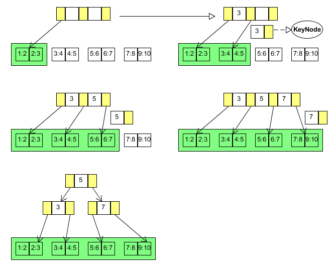

# FPTreeBD 系统说明书

此文档是对于课程设计 **FPTreeBD** 的系统说明书，由于是根据基础模板上进行补全开发，系统说明书的很多细节会在逐步完成的过程中
补全。

## 1 引言

### 1.1 编写目的

此说明书是对本次课程设计的需求明确，以及对后续开发过程中的主要依据和详细说明。

### 1.2 背景

项目名称: FPTreeBD键值储存系统
项目组成员: 陈扬、陈伟松、陆记、牛凌宇

### 1.3 参考资料
.

## 2 系统介绍

### 2.1 系统需求

本次课程设计是实现一个简单的键值储存系统，其原理是基于针对NVM优化的数据结构FPTree。最终包装成一个调用库，并且对外可用的对数据实现4种基本操作:

1. Insert 增加数据
2. Remove 删除数据
3. Update 更改数据
4. Find 查询数据

实现的是单线程的FPTree。

### 2.2 系统结构

系统基于数据结构FPTree，架构如下


### 2.3 项目目录结构

```
|__gtest: 为Google Test项目目录，不用管  
|__include: 里包含所有用到的头文件  
   |__fptree: fptree的头文件所在文件夹  
      |__fptree.h: fptree地头文件  
   |__utility: fptree所用工具的头文件所在文件夹  
      |__utility.h: 指纹计算等工具函数所在头文件  
      |__clhash.h: 指纹计算所用哈希函数头文件  
      |__p_allocator.h: NVM内存分配器头文件  
|__src: 为项目源码所在地，完成里面所有的实现  
   |__bin: 可执行文件所在文件夹
      |__main: main.cpp的可执行文件
      |__lycsb: lycsb.cpp的可执行文件
      |__ycsb: ycsb.cpp的可执行文件
   |__fptree.cpp: fptree的源文件，项目核心文件
   |__clhash.c: 指纹计算的哈希函数源文件  
   |__p_allocator.cpp: NVM内存分配器源文件
   |__lycsb.cpp: LevelDB的YCSB测试代码  
   |__ycsb.cpp: FPTreeDB和LevelDB的YCSB对比测试代码  
   |__makefile: src下项目的编译文件  
|__workloads: 为YCSB测试负载文件，用于YCSB Benchmark测试  
   |__数据量-rw-读比例-写比例-load.txt: YCSB测试数据库装载文件  
   |__数据量-rw-读比例-写比例-run.txt: YCSB测试运行文件  
|__test: 为Google Test用户测试代码所在，请完成编译并通过所有测试  
   |__bin: 单元测试可执行文件所在文件夹
      |__fptree_test: fptree_test.cpp的可执行文件
      |__utility_test: utility_test.cpp的可执行文件
   |__fptree_test.cpp: fptree相关测试  
   |__utility_test.cpp: PAllocator等相关测试  
   |__makefile: gtest单元测试的编译文件
```
### 2.4 项目检验标准

通过使用 **YCSB测试** 和 **Google Test测试** 来检验此项目的完成情况

## 3 系统实现

### 3.1 FPTree

这是整个键值存储系统的接口类

#### FPTree::FPTree(uint64_t t_degree)

构造函数

#### FPTree::~FPTree()

析构函数

#### void FPTree::recursiveDelete(Node* n)

删除整棵树，被析构函数调用

#### bool FPTree::bulkLoading() {

这是重建树的主要函数  
先检查目标文件夹内有没有数据文件，遍历文件进行BulkLoading  
没有数据文件则进行新树的生成



#### InnerNode* FPTree::getRoot()

获得根节点

#### void FPTree::changeRoot(InnerNode* newRoot)

产生新的根节点

#### void FPTree::printTree()

打印树

#### FPTree::insert(Key k, Value v)

增加数据

直接调用节点的函数

#### bool FPTree::remove(Key k)

删除数据

直接调用节点的函数

#### bool FPTree::update(Key k, Value v)

更新数据

直接调用节点的函数

#### Value FPTree::find(Key k)

查找数据

直接调用节点的函数

### 3.2 KeyNode

这个数据结构由一个代表键值和节点的索引组成，用于节点分裂时，将新生成的节点索引返回给上层节点插入记录.  
其用在插入操作和分裂操作中。 
如下图  


### 3.3 InnerNode

这是FPTree中间索引节点，其不存放键值对数据信息，结构如下：


#### InnerNode::InnerNode(const int& d, FPTree* const& t, bool _isRoot)

构造函数

#### InnerNode::~InnerNode()

析构函数

#### int InnerNode::findIndex(const Key& k) 

二分查找目标子节点

#### void InnerNode::insertNonFull(const Key& k, Node* const& node)

节点不满直接插入

#### KeyNode* InnerNode::insert(const Key& k, const Value& v)

键值对插入

#### KeyNode* InnerNode::insertLeaf(const KeyNode& leaf) 

插入叶子节点

#### KeyNode* InnerNode::split()

分裂满了的节点

#### bool InnerNode::remove(const Key& k, const int& index, InnerNode* const& parent, bool &ifDelete)、

键值对删除

#### void InnerNode::getBrother(const int& index, InnerNode* const& parent, InnerNode* &leftBro, InnerNode* &rightBro)

获得中间节点的左右兄弟节点。如果左右兄弟都存在，统一处理右兄弟。

#### void InnerNode::mergeParentLeft(InnerNode* const& parent, InnerNode* const& leftBro)

与父亲节点以及左兄弟合并

#### void InnerNode::mergeParentRight(InnerNode* const& parent, InnerNode* const& rightBro)

与父亲节点以及右兄弟合并

#### void InnerNode::redistributeLeft(const int& index, InnerNode* const& leftBro, InnerNode* const& parent)

与左兄弟重分布

#### void InnerNode::redistributeRight(const int& index, InnerNode* const& rightBro, InnerNode* const& parent)

与右兄弟重分布

#### void InnerNode::mergeLeft(InnerNode* const& leftBro, const Key& k)

与左兄弟合并

#### void InnerNode::mergeRight(InnerNode* const& rightBro, const Key& k)

与右兄弟合并

#### void InnerNode::removeChild(const int& keyIdx, const int& childIdx)

删除儿子

#### bool InnerNode::update(const Key& k, const Value& v)

键值对修改

#### Value InnerNode::find(const Key& k)

键值对查询

#### Node* InnerNode::getChild(const int& idx)

获得儿子

#### Key InnerNode::getKey(const int& idx)

获得key

#### void InnerNode::printNode()

打印节点

### 3.4 LeafNode

这是整个FPTree存储数据的直接对象，所有键值对数据只存放于叶子节点中。  
叶子节点也是与NVM交互的对象，只要是操作PAllocator映射NVM文件后的虚拟地址，通过文件映射的方式操作相应数据文件。  
因为节点的操作对象是内存映射文件数据后的虚拟地址，所以关键是设置好NVM数据的指针。结构如下：  


#### LeafNode::LeafNode(FPTree* t) && LeafNode::LeafNode(PPointer p, FPTree* t) 

构造函数

#### LeafNode::~LeafNode()

析构函数

#### void LeafNode::printNode()

打印节点

#### KeyNode* LeafNode::insert(const Key& k, const Value& v)

键值对插入

#### void LeafNode::insertNonFull(const Key& k, const Value& v)

节点不满直接插入

#### KeyNode* LeafNode::split()

分裂

#### Key LeafNode::findSplitKey()

找到中间值的key

#### int LeafNode::getBit(const int& idx)

得到bit

#### Key LeafNode::getKey(const int& idx)

得到key

#### Value LeafNode::getValue(const int& idx)

得到值

#### PPointer LeafNode::getPPointer()

得到指针

#### bool LeafNode::remove(const Key& k, const int& index, InnerNode* const& parent, bool &ifDelete)

键值对删除

#### bool LeafNode::update(const Key& k, const Value& v)

键值对修改

#### Value LeafNode::find(const Key& k)

键值对查询

#### int LeafNode::findFirstZero() 

找到第一个空节点

#### void LeafNode::persist()

保存真个叶子

### 3.5 PAllocator

这是NVM文件管理的主要对象，其负责分配LeafNode在NVM中的空间，映射数据文件并返回虚拟地址给LeafNode使用。其管理的叶子文件的粒度是一个LeafGroup，一个LeafGroup由多个叶子以及一个数据头组成，数据头由一个8字节的当前LeafGroup使用叶子数和叶子槽的bitmap，bitmap为了简单使用1个byte指明一个槽位。

#### 3.5.1 主要数据文件
1. LeafGroup结构：| usedNum(8 bytes) | bitmap(n bytes) | Leaf1 | ... | leafN |
2. catelog：| maxFileId(8 bytes) | freeNum(8 bytes) | treeStartLeaf(PPointer) |
3. freeList：| (fId, offset)1, ..., (fId)N |

#### 3.5.2 类描述

此类是单例模式，一次只能打开一个FPTree

##### PAllocator::PAllocator()

构造函数

读取NVM非意识性内存中的catlog和freeList文件，载入上次运行结束的状态

##### PAllocator::~PAllocator()

析构函数

解除虚拟地址和fileId之间的映射关系，将pAllocator指为NULL

##### void PAllocator::initFilePmemAddr()

载入上一次状态后根据fileID映射到虚拟地址

##### char *PAllocator::getLeafPmemAddr(PPointer p)

获取一个叶节点的虚拟地址

##### bool PAllocator::getLeaf(PPointer &p, char *&pmem_addr)

获取一个叶节点

##### bool PAllocator::ifLeafUsed(PPointer p)

判断叶节点是否被使用

##### bool PAllocator::ifLeafFree(PPointer p)

判断叶节点是否空闲

##### bool PAllocator::ifLeafExist(PPointer p)

判断叶节点是否存在

##### bool PAllocator::freeLeaf(PPointer p)

释放叶节点

##### bool PAllocator::persistCatalog()

写入Catalog和freeList进入文件

##### bool PAllocator::newLeafGroup()

创建一个新的LeafGroup

### 3.6 ycsb

这是一个键值数据库性能测试的benchmark

其中的命令格式:

```
Commands:
  read key [field1 field2 ...] - Read a record
  scan key recordcount [field1 field2 ...] - Scan starting at key
  insert key name1=value1 [name2=value2 ...] - Insert a new record
  update key name1=value1 [name2=value2 ...] - Update a record
  delete key - Delete a record
  table [tablename] - Get or [set] the name of the table
  quit - Quit
``` 

#### 3.6.1 第一步: 读取load文件

初始化数据库

#### 3.6.2 第二步: 读取run文件

对数据库进行操作

## 4 实现时间计划