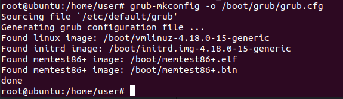

# 论文阅读与前期工作总结
### 姓名：陈扬, 陈伟松, 牛凌宇, 陆记
### 学号：17343017，17343015, 17343091, 17343080
---
## 前期工作

### 使用示意图展示普通文件IO方式(fwrite等)的流程，即进程与系统内核，磁盘之间的数据交换如何进行？为什么写入完成后要调用fsync？

普通文件io方式通过缓冲区对文件进行间接操作以此提高文件读写效率,当进程fwrite写文件时,首先要向系统内核发出请求,系统内核再将数据存到缓冲区中,如果缓冲区未满,则不将缓冲区输出到磁盘文件中,一直到缓冲区满或者系统内核需要再次使用缓冲区时,才会将缓冲区文件写入.

调用fsync是因为普通文件io方式是一种延迟写策略,它并不是在要修改文件时即时修改,而是要等到缓冲区满或复用才会,以此减少写时间,提高效率,但是采用这种方式在系统异常退出时可能导致修改文件的数据留在缓冲区而没有即时存到磁盘文件的情况,在多进程情况下也会造成数据不一致的情况,调用fsync就是为了防止这些情况产生,fsync为文件写加锁,只有在文件写操作落实到磁盘文件上后才会解锁,它的作用在数据库系统中相当于是保证了数据的一致性.
### 简述文件映射的方式如何操作文件。与普通IO区别？为什么写入完成后要调用msync？文件内容什么时候被载入内存？
(使用什么函数，函数的工作流程)  

与普通io的不同之处在与普通io是通过buffer来对文件进行间接操作,而文件映射是直接找到文件数据所在内存地址对内存进行操作,这样对大文件读写有大优势,且文件映射中用户空间和系统空间各自修改操作可以直接反映在映射的区域内,具有高效的交互性,方便实现内存共享,可以实现大文件的高效传输

调用msync是因为进程在映射空间的对共享内容的改变并不直接写回到磁盘文件中，往往在调用munmap（）后才执行该操作。可以通过调用msync()实现磁盘上文件内容与共享内存区的内容一致.

MapViewOfFile（）时文件内容被载入内存

### 参考[Intel的NVM模拟教程](https://software.intel.com/zh-cn/articles/how-to-emulate-persistent-memory-on-an-intel-architecture-server)模拟NVM环境，用fio等工具测试模拟NVM的性能并与磁盘对比（关键步骤结果截图）。
（推荐Ubuntu 18.04LTS下配置，跳过内核配置，编译和安装步骤）

以root权限用vim打开grub文件  
  

打开后原grub文件是这样的  
  

修改，在GRUB_CMDLINE_LINUX_DEFAULT中加入memmap=2G!8G，用:wq!保存并退出  
  

为了方便创建超级用户root  
  

启动配置文件  
  

重启后，查看内存仿真  
  

查看内核中是否内置了 DAX 和 PMEM  

安装包含 DAX 的文件系统，先创建文件夹  
  

然后制作文件系统  
  

映射，可以查看到pmem0  
  

在NVM上用fio测试性能  

得出结果  

在磁盘上用fio测试性能  
  

得出结果
  

可以看到NVM比磁盘快很多  

### 使用[PMDK的libpmem库](http://pmem.io/pmdk/libpmem/)编写样例程序操作模拟NVM（关键实验结果截图，附上编译命令和简单样例程序）。
（样例程序使用教程的即可，主要工作是编译安装并链接PMDK库）

目标是编译安装并链接PMDK库，先从github上clone下pmdk  
  

然后安装好下列pmdk所需要的包  

检查版本  
  

编译安装  
  

链接  
  

加入到共享库配置文件，然后就可以编译运行程序了  
  

这里使用的程序是提供的样例程序如下：

    /*
     * Copyright 2014-2017, Intel Corporation
     *
     * Redistribution and use in source and binary forms, with or without
     * modification, are permitted provided that the following conditions
     * are met:
     *
     *     * Redistributions of source code must retain the above copyright
     *       notice, this list of conditions and the following disclaimer.
     *
     *     * Redistributions in binary form must reproduce the above copyright
     *       notice, this list of conditions and the following disclaimer in
     *       the documentation and/or other materials provided with the
     *       distribution.
     *
     *     * Neither the name of the copyright holder nor the names of its
     *       contributors may be used to endorse or promote products derived
     *       from this software without specific prior written permission.
     *
     * THIS SOFTWARE IS PROVIDED BY THE COPYRIGHT HOLDERS AND CONTRIBUTORS
     * "AS IS" AND ANY EXPRESS OR IMPLIED WARRANTIES, INCLUDING, BUT NOT
     * LIMITED TO, THE IMPLIED WARRANTIES OF MERCHANTABILITY AND FITNESS FOR
     * A PARTICULAR PURPOSE ARE DISCLAIMED. IN NO EVENT SHALL THE COPYRIGHT
     * OWNER OR CONTRIBUTORS BE LIABLE FOR ANY DIRECT, INDIRECT, INCIDENTAL,
     * SPECIAL, EXEMPLARY, OR CONSEQUENTIAL DAMAGES (INCLUDING, BUT NOT
     * LIMITED TO, PROCUREMENT OF SUBSTITUTE GOODS OR SERVICES; LOSS OF USE,
     * DATA, OR PROFITS; OR BUSINESS INTERRUPTION) HOWEVER CAUSED AND ON ANY
     * THEORY OF LIABILITY, WHETHER IN CONTRACT, STRICT LIABILITY, OR TORT
     * (INCLUDING NEGLIGENCE OR OTHERWISE) ARISING IN ANY WAY OUT OF THE USE
     * OF THIS SOFTWARE, EVEN IF ADVISED OF THE POSSIBILITY OF SUCH DAMAGE.
     */

    /*
     * simple_copy.c -- show how to use pmem_memcpy_persist()
     *
     * usage: simple_copy src-file dst-file
     *
     * Reads 4k from src-file and writes it to dst-file.
     */

    #include <sys/types.h>
    #include <sys/stat.h>
    #include <fcntl.h>
    #include <stdio.h>
    #include <errno.h>
    #include <stdlib.h>
    #ifndef _WIN32
    #include <unistd.h>
    #else
    #include <io.h>
    #endif
    #include <string.h>
    #include <libpmem.h>

    /* just copying 4k to pmem for this example */
    #define BUF_LEN 4096

    int main(int argc, char *argv[])
    {
    	int srcfd;
    	char buf[BUF_LEN];
    	char *pmemaddr;
    	size_t mapped_len;
    	int is_pmem;
    	int cc;

    	if (argc != 3) {
    		fprintf(stderr, "usage: %s src-file dst-file\n", argv[0]);
    		exit(1);
    	}

    	/* open src-file */
    	if ((srcfd = open(argv[1], O_RDONLY)) < 0) {
    		perror(argv[1]);
    		exit(1);
    	}

    	/* create a pmem file and memory map it */
    	if ((pmemaddr = pmem_map_file(argv[2], BUF_LEN,
    				PMEM_FILE_CREATE|PMEM_FILE_EXCL,
    				0666, &mapped_len, &is_pmem)) == NULL) {
    		perror("pmem_map_file");
    		exit(1);
    	}

    	/* read up to BUF_LEN from srcfd */
    	if ((cc = read(srcfd, buf, BUF_LEN)) < 0) {
    		pmem_unmap(pmemaddr, mapped_len);
    		perror("read");
    		exit(1);
    	}

    	/* write it to the pmem */
    	if (is_pmem) {
    		pmem_memcpy_persist(pmemaddr, buf, cc);
    	} else {
    		memcpy(pmemaddr, buf, cc);
    		pmem_msync(pmemaddr, cc);
    	}

    	close(srcfd);
    	pmem_unmap(pmemaddr, mapped_len);

    	exit(0);
    }

---
## 论文阅读

### 总结一下本文的主要贡献和观点(500字以内)(不能翻译摘要)。
>因为持久树对延迟十分敏感，而SCM比DRAM的延迟相对更高，所以当把持久树做为SCM的基本构建块时，虽然使SCM具有了持久性，但在写入时明显比DRAM慢。因此为了让SCM拥有与DRAM相似的物理性能，本文提出了混合SCM-DRAM持久性和并发性的一种B+-Tree——FPTree（指纹持久树）。这种树运用了“指纹识别”的技术，“指纹”相当于一个过滤器，通过在搜索过程先扫描它们来避免产生与搜索关键字无关的指纹，从而大大提高了SCM的性能。在本文中，也通过定义一个持久化指针解决了内存分配持久引起的内存泄漏的问题以及通过使用以原子方式写入的flags来指示写操作是否完成从而解决了SCM字粒度写入引起的部分写入的问题。同时，因为持久性的内存分配花销太大，为了解决这个问题，本文提出了可以通过一次分配多个叶子的块来是实现分摊式的持久性内存分配。除此之外，为了提高 性能，在实现过程中允许事务在求助于回退机制之前重试几次，而使用HTM明显与我们需要将数据刷新到持久内存以确保一致性不兼容，所以为了解决这一问题，本文提出了选择性并发的技术，即对数据的暂态部分和持久部分采用不同的并发方案。FPTree的意义在于保证了内存任何节点崩溃然后恢复到一致状态而不会丢失任何信息；提高了SCM的恢复性能；在高并发场景中，可以很好地适应高SCM延迟，并且可以很好地扩展。

### SCM硬件有什么特性？与普通磁盘有什么区别？普通数据库以页的粒度读写磁盘的方式适合操作SCM吗？
>特性：  
>1、按字节寻址  
>2、非易失性  
>3、延迟低且不对称  
>4、比DRAM更密集  
>5、高效节能  
  
>SCM与普通磁盘的区别：存取速度比普通磁盘快很多，但价格比普通磁盘高。  
  
>普通数据库以页的粒度读写磁盘的方式不适合操作SCM，因为SCM是以字的粒度写入的。  
### 操作SCM为什么要调用CLFLUSH等指令？
>因为软件无法访问SCM中的所有缓冲区，而没有软件的支持，根本无法保证SCM写入的顺序和持久性。所以需要通过调用CLFLUSH、MFENCE、SFENCE等指令来确定执行SCM内存操作的顺序。如果写入后不调用这些指令，当系统崩溃后，系统的数据都会流失。

### FPTree的指纹技术有什么重要作用？
>指纹是指FPTree叶子密钥的单字节哈希值，在叶子的开头连续存储，而指纹相当于一个过滤器，在搜索过程中，通过先搜索它们来避免产生与搜索关键字无关的指纹，这样可以减少搜索的次数从而大大提高SCM的性能。

### 为了保证指纹技术的数学证明成立，哈希函数应如何选取？
（哈希函数生成的哈希值具有什么特征，能简单对键值取模生成吗？）  
>哈希值特征：符合均匀分布。
>不能简单对键值取模生成。
### 持久化指针的作用是什么？与课上学到的什么类似？
>作用：可以通过调用持久化指针访问内存中的历史数据，以检查是否存在内存泄漏。
>pid+offset
