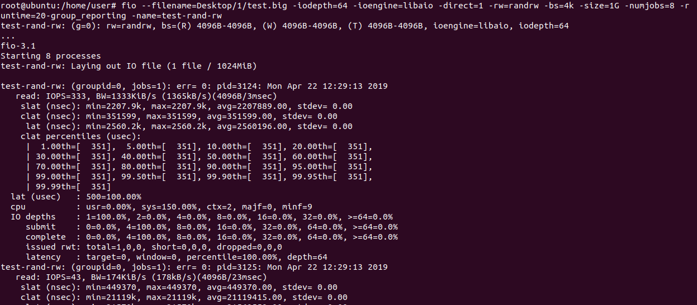

# 论文阅读与前期工作总结
### 姓名：陈扬, 陈伟松, 牛凌宇, 陆记
### 学号：17343017，17343015, 17343091, 17343080
---
## 前期工作

### 使用示意图展示普通文件IO方式(fwrite等)的流程，即进程与系统内核，磁盘之间的数据交换如何进行？为什么写入完成后要调用fsync？
XXXXXX
### 简述文件映射的方式如何操作文件。与普通IO区别？为什么写入完成后要调用msync？文件内容什么时候被载入内存？
(使用什么函数，函数的工作流程)  
XXXXXX

### 参考[Intel的NVM模拟教程](https://software.intel.com/zh-cn/articles/how-to-emulate-persistent-memory-on-an-intel-architecture-server)模拟NVM环境，用fio等工具测试模拟NVM的性能并与磁盘对比（关键步骤结果截图）。
（推荐Ubuntu 18.04LTS下配置，跳过内核配置，编译和安装步骤）

以root权限用vim打开grub文件  
  

打开后原grub文件是这样的  
  

修改，在GRUB_CMDLINE_LINUX_DEFAULT中加入memmap=2G!8G，用:wq!保存并退出  
  

为了方便创建超级用户root  
  

启动配置文件  
  

重启后，查看内存仿真  
  

查看内核中是否内置了 DAX 和 PMEM  

安装包含 DAX 的文件系统，先创建文件夹  
  

然后制作文件系统  
  

映射，可以查看到pmem0  
  

在NVM上用fio测试性能  

得出结果  

在磁盘上用fio测试性能  
  

得出结果
  

可以看到NVM比磁盘快很多  

### 使用[PMDK的libpmem库](http://pmem.io/pmdk/libpmem/)编写样例程序操作模拟NVM（关键实验结果截图，附上编译命令和简单样例程序）。
（样例程序使用教程的即可，主要工作是编译安装并链接PMDK库）

---
## 论文阅读

### 总结一下本文的主要贡献和观点(500字以内)(不能翻译摘要)。
（回答本文工作的动机背景是什么，做了什么，有什么技术原理，解决了什么问题，其意义是什么）

XXXXXX

### SCM硬件有什么特性？与普通磁盘有什么区别？普通数据库以页的粒度读写磁盘的方式适合操作SCM吗？
XXXXXX
### 操作SCM为什么要调用CLFLUSH等指令？
(写入后不调用，发生系统崩溃有什么后果)  
XXXXXX

### FPTree的指纹技术有什么重要作用？
XXXXXX

### 为了保证指纹技术的数学证明成立，哈希函数应如何选取？
（哈希函数生成的哈希值具有什么特征，能简单对键值取模生成吗？）  
XXXXXX

### 持久化指针的作用是什么？与课上学到的什么类似？
XXXXXX
